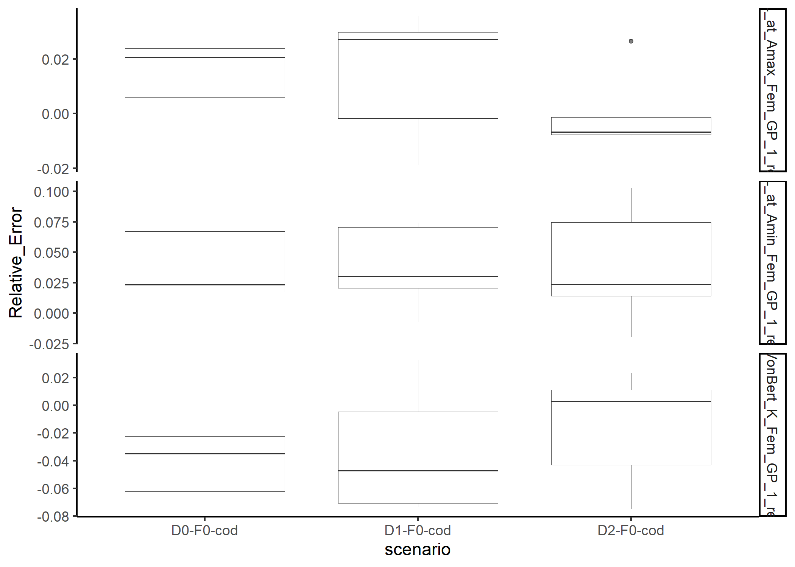
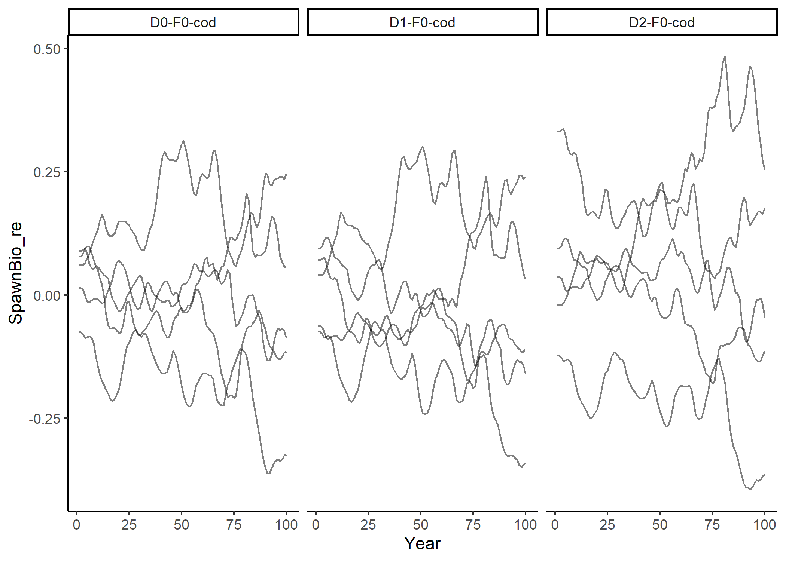

## What is this document?

Here is a dynamic document to describe the current simulations being run
in the script code/run\_sims.R. This will be updated as the project
progresses, but will be commited so it will be possible to review
previous version of this document.

## Background

Conditional age at length (CAAL or CAL) data is commonly used in stock
assessments for several reasons, the two main ones being to mimic the
actual sampling process and to provide data that can better inform
estimates of growth. Despite its widespread use, there is minimal
guidance on when it should be used. [Lee et
al. 2019](https://doi.org/10.1016/j.fishres.2019.04.007) used a
simulation study to demonstrate that CAL data should not be treated as
such in the assessment model if it is not representative of the
population. While this study provides some advice to stock assessment
scientists about when CAAL data should and should not be use in
assessment, many questions still remain.

## Research Questions

We will start by attempting to address the question:

  - How many years of CAL data do we need to get growth right?

## Methods: simulation setup

### OM

Basic cod model with 2 way trip for F. Get expected values for CAL data.
No age comp marginals, only the length comp that goes with CAL
estimates.

### Sampling to get data to feed into EM

  - Different yrs of cal comp data. Start with none, then add on 2 yrs
    of data each time, for about 5 different scenarios. Do initial runs
    to see how this is going. 0 yrs, 2 yrs, 4 yrs, 6 yrs, 8 yrs of data.
  - Leave sample sizes for each year the same for now. This is an
    interaction we could also investigate.

### EM

The EM has no misspecification relative to the OM, but estimate some
growth parameters, starting them at the initial values from the EM.
Perhaps everything else is fixed at true value to start?

### Running using ss3sim

Get started on these by setting up these simulations and running 1
iteration of each simulation version. Can then increase number of
iterations and maybe change up scenarios if initial findings indicate a
direction to go in.

### Initial performance metrics

Initial performance metrics: relative error in growth
parameters (VonBert K, length at min age, length at max age)

## Results

<!-- It may be useful to add a few key graphics here and a key table summary.-->

<!-- If someone wants more details, they can look in the "results" folder to -->

<!-- explore whichever metrics they would like to.  -->
