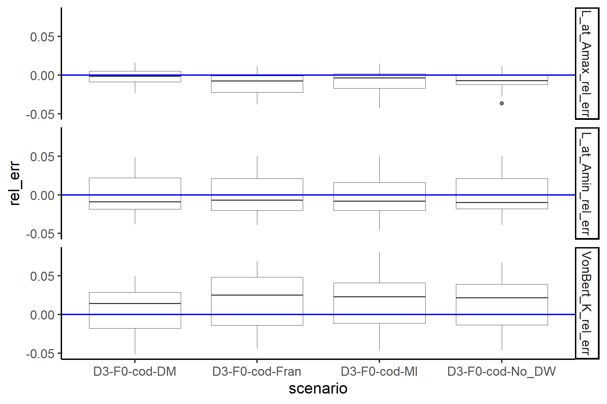
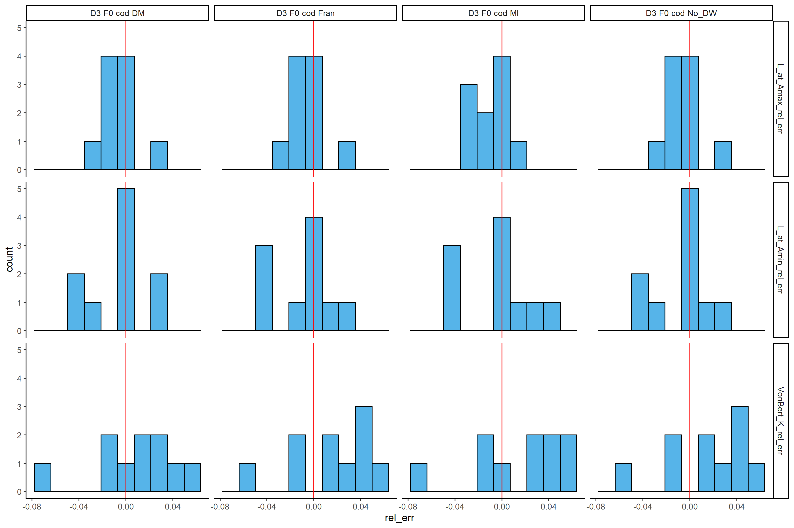
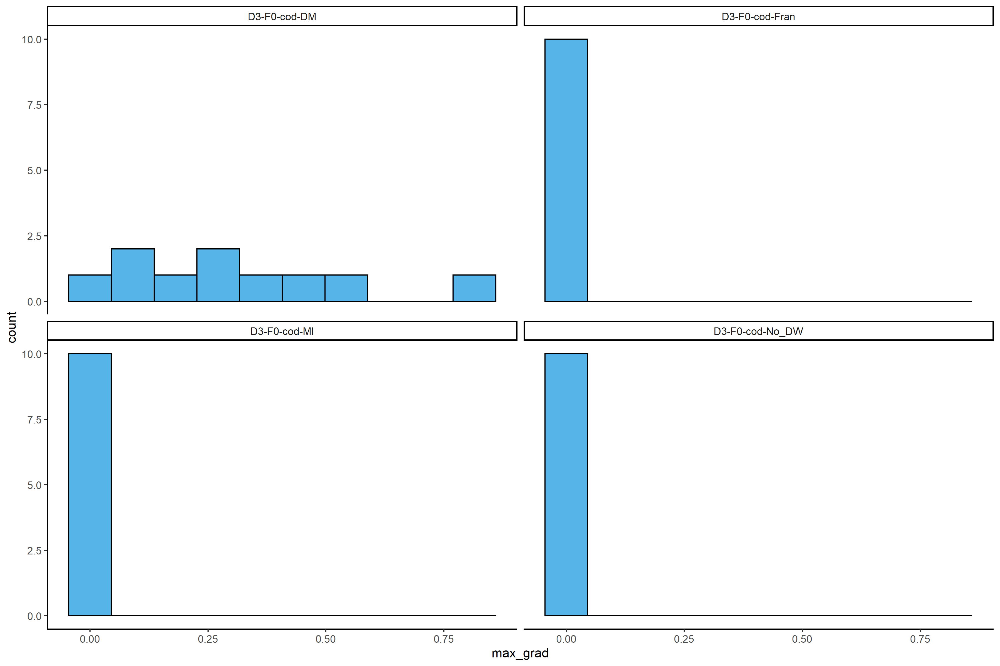

## What is this document?

Here is a dynamic document to describe the current simulations being run
in the script code/test\_run\_CAL\_and\_dataweighting.R. This will be updated as the project
progresses, but will be commited so it will be possible to review
previous version of this document.

## Background

Conditional age at length (CAAL or CAL) data is commonly used in stock
assessments for several reasons, the two main ones being to mimic the
actual sampling process and to provide data that can better inform
estimates of growth. Despite its widespread use, there is minimal
guidance on when it should be used. [Lee et
al. 2019](https://doi.org/10.1016/j.fishres.2019.04.007) used a
simulation study to demonstrate that CAL data should not be treated as
such in the assessment model if it is not representative of the
population. While this study provides some advice to stock assessment
scientists about when CAAL data should and should not be use in
assessment, many questions still remain.

## Research Questions

We will start by attempting to address the question:

  - How does the data weighting method used affect growth estimation when using CAL data?

## Methods: simulation setup

### OM

Basic cod model with 2 way trip for F. Get expected values for CAL data.

### Sampling to get data to feed into EM

  - Use marginal age and length, as well as CAL data and an index for the survey
  - Use marginal length for the fishery
  - Use different data weighting methods by scenario: None (NO_DW), Dirichlet Multinomial (DM), Macallister-Ianelli (MI), and Francis (Fran). This is the only differences among the scenarios.
  - No bias correction has been used.

### EM

The EM has no misspecification relative to the OM, but estimate some
growth parameters, starting them at the initial values from the EM. The 
scenarios are:

- DM: Dirichlet multinomial
- Fran: Francis tuning
- MI: MacAllister Ianelli tuning
- No_DW: no comps data weighting done.

### Running using ss3sim

Get started on these by setting up these simulations and running 10
iterations of each simulation version. Can then increase number of
iterations and maybe change up scenarios if initial findings indicate a
direction to go in.

### Initial performance metrics

Initial performance metrics: relative error in growth
parameters (VonBert K, length at min age, length at max age)

## Results

### Convergence

There are no parameters on bounds for all iterations of the scenarios.

### Relative error

Relative error for growth parameters. Each scenario was run 10 times:

Relative error for growth parameters plotted as a histogram. Each scenario was run 10 times:

<!-- It may be useful to add a few key graphics here and a key table summary.-->

<!-- If someone wants more details, they can look in the "results" folder to -->

<!-- explore whichever metrics they would like to.  -->
